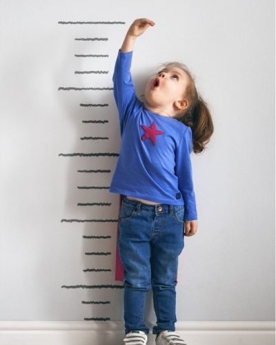
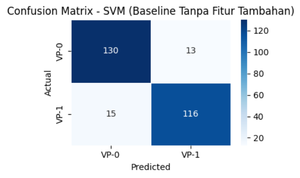
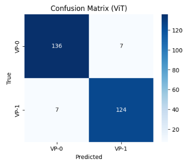
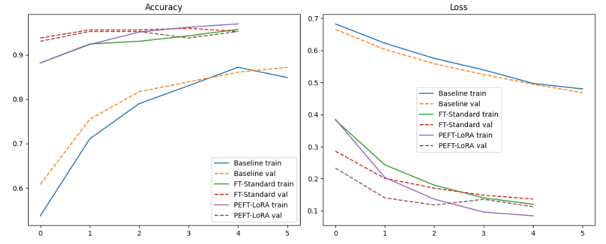
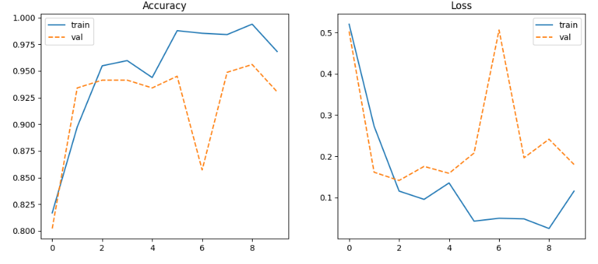

<h1 align="center">CHILD GROWTH CLASSIFICATION</h1>
---

  

  Sumber Image : <a href="https://share.google/images/DDfO5yEbx6us0Cj8h">Access Here</a>

---

<h1 align="center">📑 Table of Contents 📑</h1>

- [Deskripsi Proyek](#deskripsi-proyek)
- [Latar Belakang](#latar-belakang)
- [Tujuan Pengembangan](#tujuan-pengembangan)
- [Sumber Dataset](#sumber-dataset)
- [Preprocessing dan Pemodelan](#preprocessing-dan-pemodelan)
  - [Preprocessing Data](#preprocessing-data)
  - [Pemodelan](#pemodelan)
- [Hasil & Evaluasi](#hasil--evaluasi)

---

<h1 id="deskripsi-proyek" align="center">📚 Deskripsi Proyek 📚</h1>

Proyek ini bertujuan mengembangkan sistem klasifikasi citra wajah anak berdasarkan pola proporsi visual sebagai indikator awal pertumbuhan menggunakan pendekatan **Visual Proxy (VP)**.  
Pendekatan ini bersifat **non-medis**, sehingga model tidak melakukan diagnosis kesehatan seperti stunting, melainkan hanya mendeteksi **pola atau proporsi wajah** yang dapat menjadi indikator awal potensi ketidakseimbangan pertumbuhan.

Dalam konsep Visual Proxy, wajah anak direpresentasikan menjadi dua kategori:

- **VP-0 (Visually Proportional)** → proporsi wajah normal  
- **VP-1 (Visually Linear)** → indikasi perbedaan proporsi wajah yang tidak proporsional

Untuk menghasilkan model yang optimal, penelitian ini menguji berbagai pendekatan berbasis Machine Learning dan Deep Learning, yaitu:

### 🔹 Handcrafted Feature Models  
Menggunakan kombinasi fitur visual seperti:
- Landmark
- GLCM  
- CCM  
- SIFT  
- LBP  
- HOG  
- Gabor  
- Color Moment  
- Edge Detection  

Dengan algoritma: **SVM, Random Forest, dan K-NN**.

### 🔹 CNN-Based Models  
Meliputi:
- **Baseline CNN**
- **CNN Fine-Tuning**
- **CNN LoRA (manual & library PEFT)**

### 🔹 Pretrained Deep Learning Models  
Dua arsitektur modern digunakan:

1. **EfficientNet-B0**
   - Baseline  
   - Fine-Tuning  
   - Fine-Tuning + LoRA (rank rendah untuk efisiensi GPU)

2. **Vision Transformer (ViT-Base Patch16/224)**  
   - Baseline (tanpa LoRA)

---

<h1 id="latar-belakang" align="center">🧠 Latar Belakang 🧠</h1>

Masalah gangguan pertumbuhan seperti stunting masih menjadi isu kritis di berbagai negara berkembang. Deteksi dini merupakan langkah penting, namun metode tradisional masih bergantung pada peralatan medis, tenaga ahli, dan proses pengukuran manual yang dapat memakan waktu serta tidak selalu tersedia di lapangan.

Untuk itu, pendekatan Visual Proxy berbasis Deep Learning menjadi solusi non-medis yang cepat, efisien, serta tetap menjaga privasi data anak. Dengan hanya melihat pola visual wajah, sistem dapat membantu proses pemantauan awal tanpa intervensi medis langsung.

---

<h1 id="tujuan-pengembangan" align="center">🎯 Tujuan Pengembangan 🎯</h1>

- **Mengembangkan model klasifikasi wajah anak** berdasarkan dua kategori Visual Proxy:
  - **VP-0 (Visually Proportional)** — proporsi wajah normal  
  - **VP-1 (Visually Linear)** — indikasi ketidakseimbangan proporsi wajah  
- **Mengevaluasi dan membandingkan berbagai pendekatan Machine Learning & Deep Learning**, meliputi:
  - Handcrafted features (Landmark, GLCM, CCM, SIFT, LBP, HOG, Gabor, Color, Edge)  
  - CNN Baseline  
  - CNN Fine-Tuning  
  - CNN LoRA (manual & PEFT library)  
  - EfficientNet-B0 (baseline, fine-tuning, fine-tuning + LoRA)  
  - Vision Transformer (ViT) baseline
- **Mengoptimalkan performa model menggunakan teknik Fine-Tuning dan LoRA**, untuk meningkatkan akurasi sekaligus mempertahankan efisiensi komputasi.
- **Membangun sistem screening awal yang cepat, non-invasif, dan aman secara etika**, tanpa memerlukan data medis atau informasi sensitif anak.
- **Menentukan model terbaik** yang mampu memberikan prediksi paling stabil dan akurat untuk digunakan pada proses monitoring pertumbuhan secara visual.

---

<h1 id="sumber-dataset" align="center">📊 Sumber Dataset 📊</h1>

Dataset diperoleh dari platform Roboflow, berisi citra wajah anak-anak dengan dua kategori:

- **Healthy → VP-0**
- **Stunting → VP-1**

Dataset kemudian di-relabel ulang menggunakan format Visual Proxy, dan diproses ulang menjadi dataset wajah terpotong (face-cropped).

Link Original Dataset: 
1. *[**STUNTING Computer Vision Dataset**](https://universe.roboflow.com/test-bdpwd/stunting-onvws)*
2. *[**STUNTING Computer Vision Model**](https://universe.roboflow.com/mnt-bgmps/stunting-onvws-b12p5)*
3. *[**Deteksi Stunting Computer Vision Model**](https://universe.roboflow.com/database-ayu/deteksi-stunting)*
---

<h1 id="preprocessing-dan-pemodelan" align="center">🧼 Preprocessing dan Pemodelan 🧼</h1>

<h2 id="preprocessing-data" align="center">✨ Preprocessing Data ✨</h2>

Tahap preprocessing dimulai dengan memuat dataset wajah anak dari direktori yang telah diatur. Seluruh citra kemudian diproses menggunakan **MTCNN (Multi-Task Cascaded Convolutional Network)** untuk mendeteksi dan memotong area wajah sehingga model hanya mempelajari fitur visual yang relevan dan tidak terdistraksi oleh latar belakang. Setelah wajah berhasil diekstraksi, citra di-*resize* menjadi **224×224 piksel** dan dinormalisasi menggunakan **mean–std normalization** mengikuti standar input model pre-trained seperti EfficientNet dan Vision Transformer.

Untuk meningkatkan keragaman data dan mencegah overfitting, beberapa teknik **data augmentation** diterapkan, yaitu: rotasi acak, horizontal flip, random cropping, serta penyesuaian brightness–contrast. Dataset dibagi menggunakan **stratified split**, yaitu 80% data latih dan 20% data uji, untuk memastikan distribusi kelas **VP-0** dan **VP-1** tetap seimbang.  
Tahap preprocessing ini memastikan bahwa dataset yang digunakan bersih, konsisten, dan siap dipakai untuk seluruh eksperimen model.

---

<h2 id="pemodelan" align="center">🤖 Pemodelan 🤖</h2>

Penelitian ini menggunakan dua pendekatan utama: **(1) Handcrafted Features + Classic ML**, **(2) Deep Learning Modern (CNN, EfficientNet, dan ViT)**.  
Seluruh model dibandingkan untuk menentukan pendekatan paling ideal dalam mendeteksi Visual Proxy pada wajah anak.

---

### 🟦 **A. EfficientNet-B0 (Model Utama)**

EfficientNet-B0 dipilih karena merupakan CNN modern dengan efisiensi tinggi. Teknik **compound scaling** digunakan untuk menyeimbangkan *depth*, *width*, dan *resolution*, sehingga menghasilkan representasi fitur yang kuat pada citra wajah.

Tiga eksperimen dilakukan:

#### **1. Baseline EfficientNet**
- Classification head diubah menjadi Linear (1280 → 2)
- Training selama 10 epoch
- Optimizer Adam, LR = 1e-4  
-> Menjadi dasar pembanding performa.

#### **2. Fine-Tuning Standar**
- 40 layer teratas EfficientNet dibuka untuk dilatih ulang
- Meningkatkan kemampuan model dalam mengenali pola visual halus  
-> Performa naik signifikan dibanding baseline.

#### **3. Fine-Tuning + LoRA (Low-Rank Adaptation)**  
Pendekatan paling efisien sekaligus paling akurat:
- LoRA ditambahkan pada pointwise convolution
- Hanya parameter ber-rank rendah yang diperbarui
- Komputasi lebih ringan dibanding full fine-tuning  
-> Model **terbaik** di seluruh eksperimen.

---

### 🟪 **B. Vision Transformer (ViT-Base Patch16/224)**

Sebagai pembanding, digunakan Vision Transformer model dasar:

- Pre-trained ImageNet
- Classification head diganti menjadi Linear (768 → 2)
- Dilatih sebagai baseline (tanpa LoRA)

Hasil ViT sangat baik dan stabil, tetapi masih berada di bawah performa EfficientNet + LoRA.

---

### 🟩 **C. Model Handcrafted Features + Machine Learning**

Selain deep learning, penelitian juga mengevaluasi kombinasi fitur manual:

- **Landmark**
- **GLCM**
- **CCM**
- **SIFT**
- **LBP**
- **HOG**
- **Gabor**
- **Color Moments**
- **Edge**

Setiap fitur atau kombinasi fitur diuji menggunakan:

- **SVM**
- **Random Forest**
- **K-NN**

Hasilnya cukup baik, namun masih jauh di bawah model deep learning, terutama EfficientNet + LoRA.

---

<h1 id="hasil--evaluasi" align="center">📊 Hasil & Evaluasi 📊</h1>

**Evaluasi Model**

Model dievaluasi menggunakan beberapa metrik, termasuk **classification report** dan **confusion matrix**.

**Classification Report**

Berikut adalah penjelasan tentang metrik yang digunakan dalam classification report:

- **Precision**: Mengukur proporsi prediksi positif yang benar.
- **Recall**: Mengukur proporsi sampel aktual positif yang berhasil diidentifikasi dengan benar.
- **F1-Score**: Rata-rata harmonis dari precision dan recall.
- **Accuracy**: Mengukur keseluruhan performa model.

**Tabel Perbandingan Classification Report**

Berikut adalah perbandingan metrik evaluasi untuk setiap model:

| Model Fitur                        | Algoritma       | Akurasi | Precision | Recall | F1-Score |
|-----------------------------------|------------------|---------|-----------|--------|----------|
| Baseline                          | SVM              | 0.91    | 0.93      | 0.90   | 0.91     |
| Baseline                          | Random Forest    | 0.90    | 0.92      | 0.89   | 0.90     |
| Baseline                          | K-NN             | 0.88    | 0.97      | 0.80   | 0.87     |
| Landmark                          | SVM              | 0.86    | 0.90      | 0.83   | 0.86     |
| Landmark                          | Random Forest    | 0.85    | 0.87      | 0.85   | 0.86     |
| Landmark                          | K-NN             | 0.85    | 0.88      | 0.83   | 0.85     |
| Landmark + GLCM                   | SVM              | 0.86    | 0.91      | 0.82   | 0.86     |
| Landmark + GLCM                   | Random Forest    | 0.87    | 0.91      | 0.84   | 0.87     |
| Landmark + GLCM                   | K-NN             | 0.87    | 0.91      | 0.84   | 0.87     |
| Landmark + GLCM + CCM             | SVM              | 0.87    | 0.90      | 0.85   | 0.87     |
| Landmark + GLCM + CCM             | Random Forest    | 0.86    | 0.89      | 0.84   | 0.86     |
| Landmark + GLCM + CCM             | K-NN             | 0.84    | 0.87      | 0.82   | 0.84     |
| Landmark + GLCM + CCM + SIFT      | SVM              | 0.85    | 0.89      | 0.82   | 0.85     |
| Landmark + GLCM + CCM + SIFT      | Random Forest    | 0.87    | 0.92      | 0.82   | 0.87     |
| Landmark + GLCM + CCM + SIFT      | K-NN             | 0.81    | 0.82      | 0.82   | 0.82     |
| LBP                               | SVM              | 0.80    | 0.82      | 0.79   | 0.80     |
| LBP                               | Random Forest    | 0.76    | 0.76      | 0.79   | 0.77     |
| LBP                               | K-NN             | 0.76    | 0.75      | 0.79   | 0.77     |
| LBP + HOG                         | SVM              | 0.83    | 0.85      | 0.82   | 0.84     |
| LBP + HOG                         | Random Forest    | 0.80    | 0.79      | 0.85   | 0.82     |
| LBP + HOG                         | K-NN             | 0.73    | 0.86      | 0.58   | 0.69     |
| LBP + HOG + GABOR                 | SVM              | 0.83    | 0.85      | 0.82   | 0.84     |
| LBP + HOG + GABOR                 | Random Forest    | 0.82    | 0.81      | 0.87   | 0.84     |
| LBP + HOG + GABOR                 | K-NN             | 0.73    | 0.86      | 0.58   | 0.69     |
| LBP + HOG + GABOR + COLOR         | SVM              | 0.85    | 0.86      | 0.84   | 0.85     |
| LBP + HOG + GABOR + COLOR         | Random Forest    | 0.86    | 0.85      | 0.89   | 0.87     |
| LBP + HOG + GABOR + COLOR         | K-NN             | 0.73    | 0.86      | 0.58   | 0.69     |
| LBP + HOG + GABOR + COLOR + EDGE  | SVM              | 0.85    | 0.86      | 0.84   | 0.85     |
| LBP + HOG + GABOR + COLOR + EDGE  | Random Forest    | 0.85    | 0.85      | 0.87   | 0.86     |
| LBP + HOG + GABOR + COLOR + EDGE  | K-NN             | 0.73    | 0.86      | 0.58   | 0.69     |
| Baseline CNN                      | CNN              | 0.86    | 0.83      | 0.93   | 0.88     |
| CNN + FT Standar                  | CNN              | 0.90    | 0.91      | 0.90   | 0.91     |
| CNN + FT LoRA (Manual)            | CNN              | 0.89    | 0.91      | 0.89   | 0.90     |
| CNN + FT LoRA (Library)           | CNN              | 0.89    | 0.91      | 0.87   | 0.89     |
| Baseline EfficientNet             | EfficientNet     | 0.88    | 0.84      | 0.94   | 0.89     |
| EfficientNet + FT Standar         | EfficientNet     | 0.97    | 0.99      | 0.95   | 0.97     |
| EfficientNet + FT LoRA (Best)     | EfficientNet     | 0.98    | 0.99      | 0.97   | 0.98     |
| Vision Transformer Baseline       | ViT              | 0.95    | 0.95      | 0.95   | 0.95     |

**Confusion Matrix** 🔴🟢

Di bawah ini adalah confusion matrix untuk setiap model.

  <!-- EfficientNet Baseline -->
  
  
  <!-- EfficientNet + Fine-Tuning -->
  
  
  <!-- EfficientNet + LoRA -->
  

  <!-- Vision Transformer Baseline -->
  

**Learning Curves** 📈

Berikut adalah learning curves untuk model EfficientNet dan ViT yang menunjukkan bagaimana model belajar seiring berjalannya waktu:

  <!-- EfficientNet -->
  
  
  <!-- ViT -->
  
  

